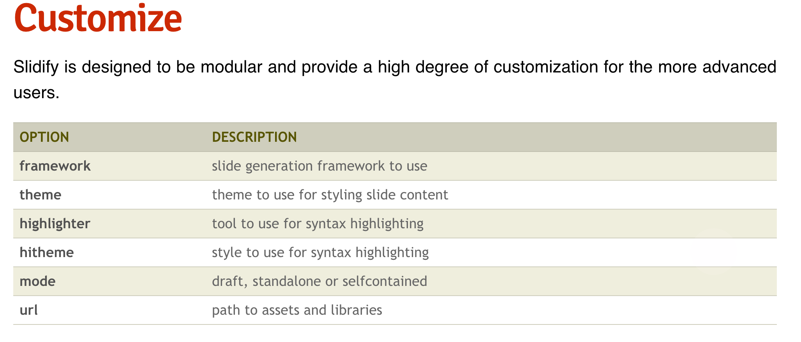

###slidify是一种html的可视化工具
###一、安装使用
```{r,eval=F}
require(devtools)  #不存在，则安装 install.packages("devtools)
install_github('ramnathv/slidify')
install_github('ramnathv/slidifyLibraries')

library(slidify)
author("mydeck")   #自动生成一个git文档，名为mydeck

# Write in RMarkdown, separating slides with a blank line followed by three dashes ---
  
publish(user = "USER", repo = "REPO")
```

###二、语法介绍
2.1 YAML，是一种标记语言，在Rmd文件中，编辑author,title,subtitle的部分就是YAML，在这部分中可以指定你的展示文件的一些属性，比如framework属性，决定了从Rmd文件生成html文件的方式，它会影响你的html文件的格式，简单说，修改成不同的值会影响你的title标签内容的展示大小。

2.2 正文编辑，##表示一张展示页面的开始，---表示结束

2.3 具体见Demo_slidify.Rmd范例


###三、特效
3.1 [widget](http://slidify.github.io/dcmeetup/demos/interactive/)
1) 使用widget，添加在YAML 首页widget部分  
```{r,eval=FALSE}
widgets    : [bootstrap, quiz]
```
具体效果见范例，**交互式问答及方法slide**


2) 使用外部widget,添加在YAML,ext_widgets : {rCharts: [libraries/nvd3]}
```{r,eval=FALSE}
#安装rCharts包
require(devtools)
install_github('ramnathv/rCharts')
```
具体效果见范例，**交互式图形：rCharts示例方法slide**
